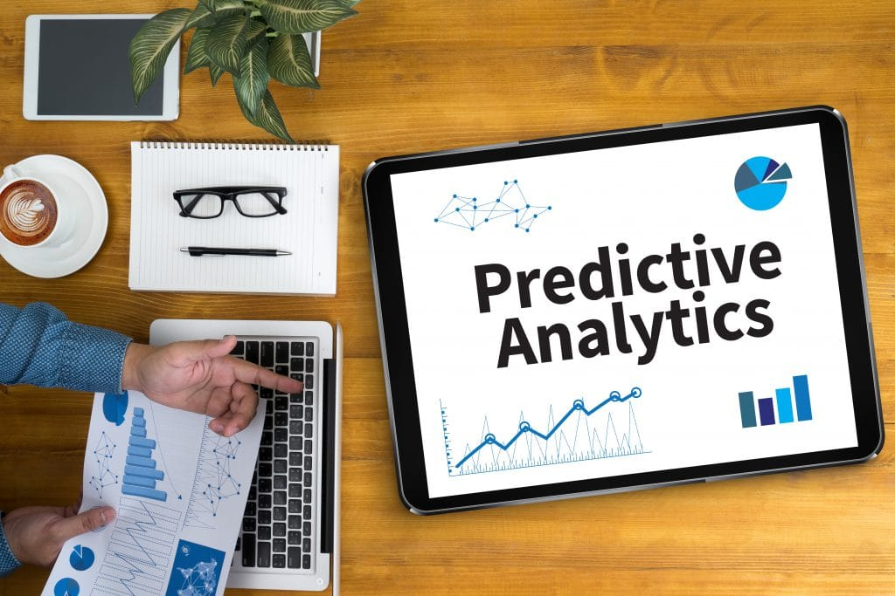

# Predictive Modeling with Linear Regression

## Project Overview

The Predictive Modeling with Linear Regression project aims to build a predictive model using linear regression to predict a numerical outcome based on one or more features. This project leverages a dataset with a continuous target variable and implements a linear regression model to forecast the target variable. The entire project is executed in a Jupyter notebook, ensuring an interactive and comprehensive analysis.

## Project Workflow

- **Data Collection**: Obtain a dataset with a continuous target variable.
- **Data Preprocessing**: Clean the data, handle missing values, and perform feature scaling if necessary.
- **Model Building**: Design and build the linear regression model.
- **Model Training**: Train the linear regression model on the dataset.
- **Model Evaluation**: Evaluate the model's performance using appropriate metrics such as Mean Squared Error (MSE) and R-squared.
- **Prediction**: Use the trained model to predict the target variable on new data.
- **Visualization**: Generate visualizations to present the actual vs. predicted values and the relationship between features and the target variable.

## Results

The project results include a trained linear regression model that predicts the target variable with reasonable accuracy. The analysis also provides visualizations comparing the actual and predicted values, highlighting the model's performance.

## Contributing

Contributions to the Predictive Modeling with Linear Regression project are welcome. Feel free to open issues or submit pull requests with improvements or new features.

## License

This project is licensed under the MIT License.

## Acknowledgments

- The dataset used in this project is sourced from publicly available data repositories or specific domains relevant to the analysis.
- This project is a part of the tasks provided by the internship at CodeAlpha.
